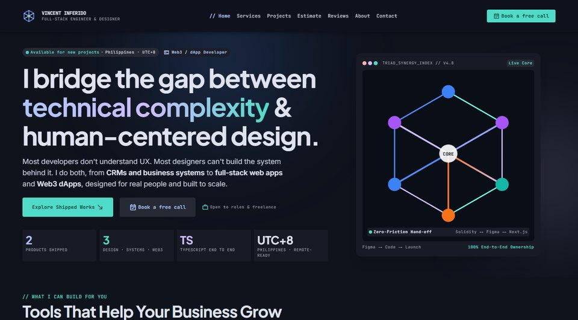

# Vincent Inferido — Portfolio

Full-stack AI-first developer & UI/UX designer: business systems and CRMs, web apps and Web3. Designed in Figma, built with Next.js and TypeScript, shipped end to end.

**Live site:** https://vincentinferido-a11y.github.io



## Highlights

- **Multichain live data:** a network switcher with Ethereum, Base, Arbitrum, Optimism, Polygon, BNB Chain and Solana. It shows live gas (or TPS on Solana) and block height (or slot) from public RPCs, and falls back to a backup endpoint automatically if one is slow or down.
- **Read-only wallet connection:** EVM wallets (EIP-1193, e.g. MetaMask) and Solana wallets (Phantom, Solflare). It only requests the public address, never signatures or transactions. Picking a chain asks a connected EVM wallet to switch networks.
- **Projects:** filterable by Systems / CRM, Full-Stack, UX/UI and Web3, followed by a concept showcase.
- **Accessibility and performance:** static HTML, compiled Tailwind (no CDN runtime), keyboard-navigable menus, reduced-motion support, and no tracking.

## Tech

Plain HTML · Tailwind CSS 3 (compiled) · vanilla JavaScript · Google Fonts · GitHub Pages

## Run locally

```bash
npm install
npm run dev      # rebuilds docs/styles.css on change
npm run serve    # http://localhost:5173
```

## Deploy

GitHub Pages serves the `docs/` folder from the `main` branch. After editing HTML classes, run `npm run build` and commit the updated `docs/styles.css`.

## Blog

Articles live in `content/blog/` as Markdown files. To publish a new one:

1. Create `content/blog/your-article-slug.md` starting with:
   ```
   ---
   title: Your Article Title
   description: One or two sentences for Google and link previews.
   date: 2026-10-15
   tags: CRM, Business
   ---
   ```
2. Write the article in Markdown below it (headings, lists, tables and links all work).
3. Run `npm run build`. It generates `docs/blog/`, the RSS feed, the sitemap and the homepage "From the Blog" strip.
4. Commit and push. GitHub Pages publishes it in about a minute.

When the custom domain is live, update `SITE_URL` in `scripts/build-blog.mjs` and rebuild.

## Customize

| What | Where |
| --- | --- |
| Content (hero, projects, about, FAQ) | `docs/index.html` |
| Contact email, form endpoint, chains, RPC endpoints, rotating roles | `CONFIG` at the top of `docs/main.js` |
| Project estimator: hourly rate, hours per project type and feature, show or hide prices | `CONFIG.estimator` in `docs/main.js` |
| Database for reviews and inquiries (Supabase) | [supabase/README.md](supabase/README.md) and `CONFIG.supabase` in `docs/main.js` |
| Design tokens (colors, type, spacing) | `tailwind.config.js` and [DESIGN.md](DESIGN.md) |

## Projects featured

- [Overland Ready](https://overland-ready-eta.vercel.app): Next.js 16 and Sanity CMS gear review site
- [RemitOtter](https://remitotter.vercel.app): Solana meme-coin platform demo (Next.js 15, MongoDB, buyback-and-burn engine)
- [Obsidian Console](https://obsidian-console-eosin.vercel.app/): infrastructure observability console for Web3 compute (live simulation, rebrandable)
- [TS Task Control](https://ts-task-control-ui.vercel.app/): operations dashboard UI system
- [Harbor Reach Studio OS](https://harbor-reach-studio-os-ui.vercel.app/): production operating system UI for a game studio (product design)
- [BoyaxDev Marketplace](https://boyaxdev-marketplace-ui.vercel.app/): website marketplace UI system
- [SkinStack](https://skinstack-ui.vercel.app/): skincare review site UI system

## Licensing & access

Copyright © 2026 Vincent Inferido. All rights reserved. This project is shared for portfolio viewing only; copying, modifying, deploying or redistributing it requires written permission. See [LICENSE](LICENSE).

**Want to use it, see more, or have something similar built?** Source access, commercial licensing and custom builds are available on request: [vincent.inferido@gmail.com](mailto:vincent.inferido@gmail.com?subject=Access%20request%3A%20Portfolio)

## Author

[Vincent Inferido](https://github.com/vincentinferido-a11y) · [LinkedIn](https://www.linkedin.com/in/vincentci/)
